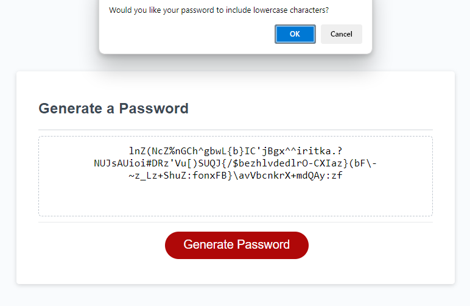

# Description

This repository uses JavaScript prompts, pseudorandom numbers and array concatenation to generate a random password with various character combinations possible.

# Installation

N/A

# Usage

Click the red 'Generate' button to launch the application and follow the instructions in the prompt windows to generate your password! The password output will replace the 'Your Secure Password' placeholder text in the main dialog.

# Credits

Input validation https://www.w3schools.com/js/js_validation.asp - *line 120 in script.js*

Function to get random element from array https://developer.mozilla.org/en-US/docs/Web/JavaScript/Reference/Global_Objects/Math/random - *lines 140 - 142 in script.js*

## License

MIT License

## GitHub Pages link

https://zerofloat.github.io/password-generator/

